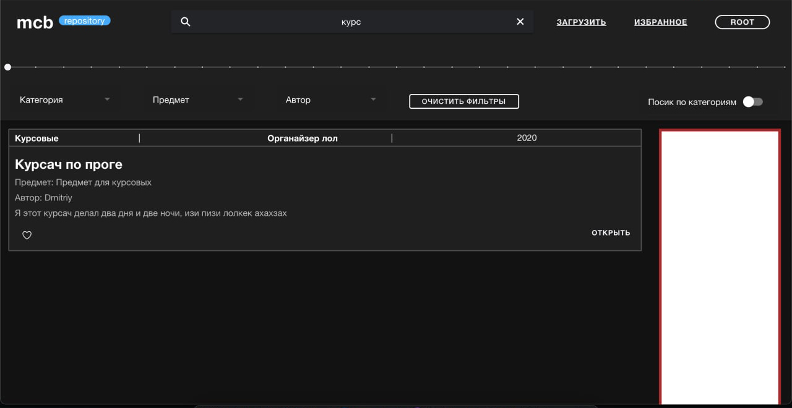
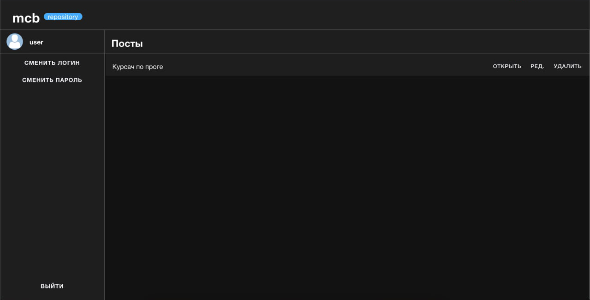
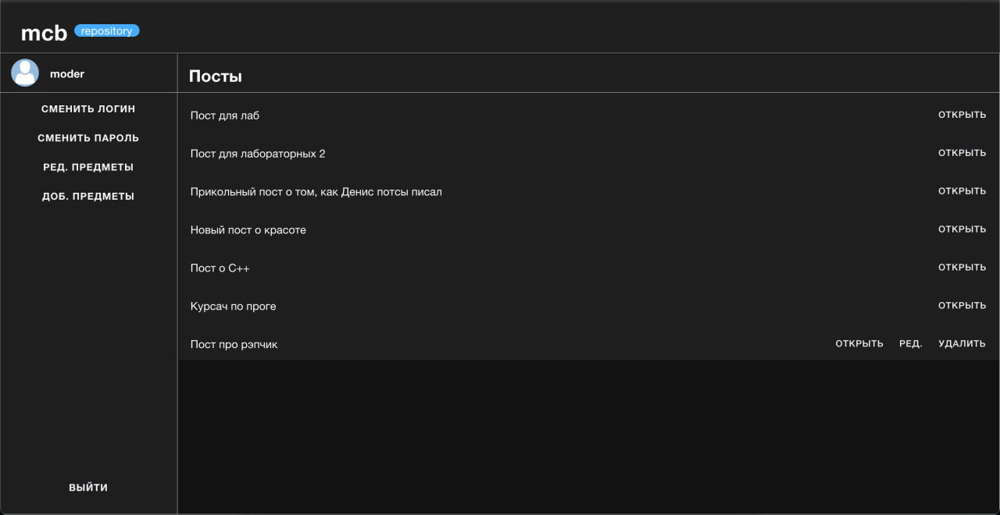
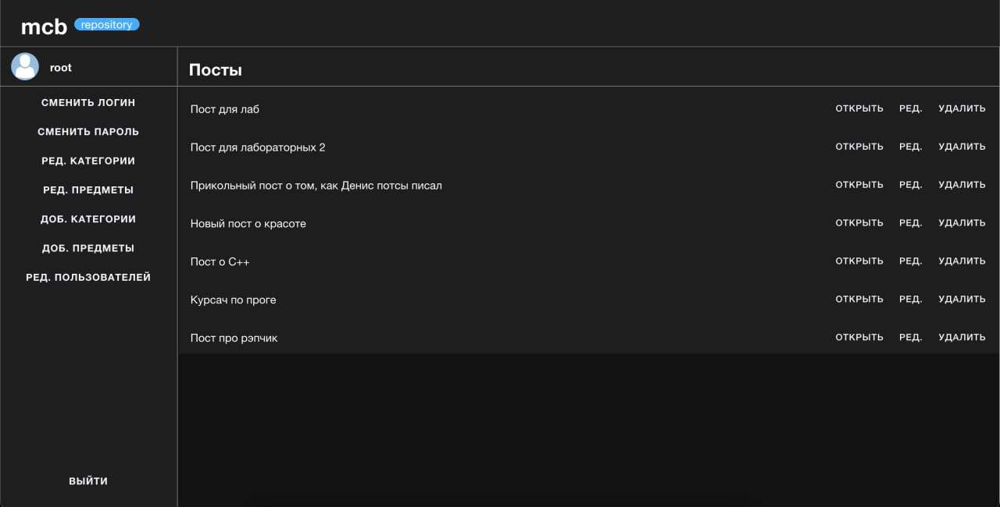
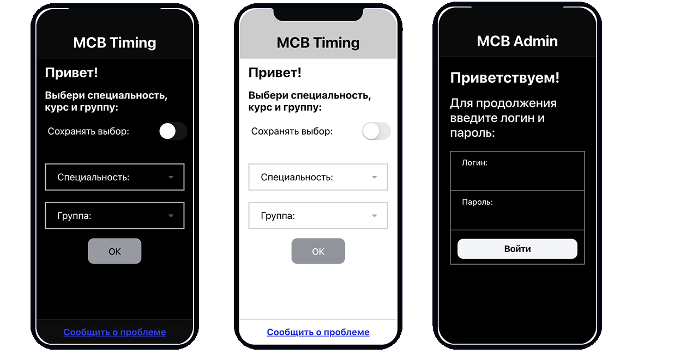
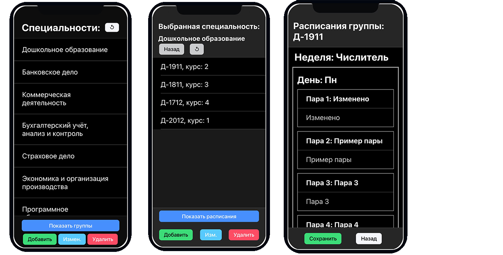

# MCB Pack
## Components:
---------------
* Express js RESTful API
* Ioinc framework timetable app (client + admin)
* Ionic framework web repository app

## Features:
--------------
* Client-Server architecture (RESTful API Based)
* User Hierarchy (Repository)
* JWT Authentication (Repository)
* Storage for different file types (pdf, doc, zip etc.)
* Searching system (Based on years, categories, name, author)
  
## Screenshots:
--------------
## Repository:
Main page and search feature:

User page (can modify and open only user's posts, moderator approve required)

Moderator page (can approve or deny user's posts, can modify his own posts)

Admin page (can modfy everything)

## Timing mobile application
Client and admin applications (translucent screens):

Admin application functions:

